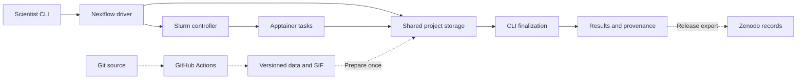
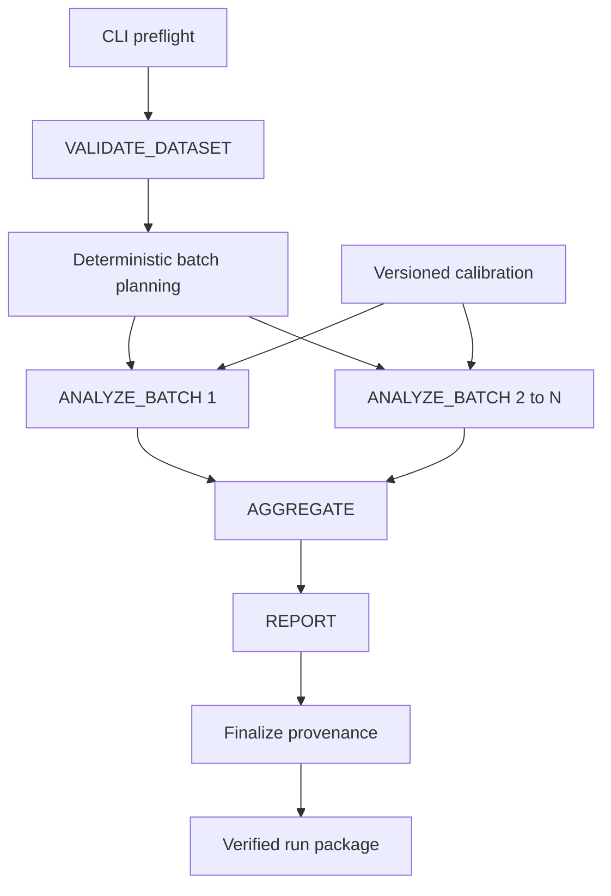

# ReproHPC Product Requirements Document

## 1. Overview & Problem

**Product:** ReproHPC  
**Target release:** `v1.0.0`  
**Delivery team:** One new-grad engineer with Python, OpenCV/NumPy, Docker, and Linux experience  
**Schedule:** Six weeks preferred; four weeks with a working Slurm environment and a stable, documented scientific routine  
**Specification date:** September 12, 2026

Research image-analysis routines often depend on undocumented parameters, manually selected files, and an individual scientist's software environment. Moving those routines to HPC adds scheduling, resource allocation, shared-storage constraints, and recovery from partial failures. A successful execution does not establish that another researcher can reproduce or interpret its results.

ReproHPC converts one existing image-analysis routine into a reproducible scientific workflow that:

- Validates versioned inputs and reference data.
- Executes independent image batches in Apptainer containers through Slurm.
- Produces scientific measurements, masks, QC summaries, and an offline report.
- Captures software, parameters, data identities, execution history, and resource usage.
- Supports interruption and resume.
- Publishes a complete, citable reproduction package through Zenodo.

**Implementation decision:** Use **Nextflow DSL2**, one Python package, one analysis container distributed as a Singularity Image Format (SIF) file, and one supported Slurm environment. Do not implement both Nextflow and Snakemake.

Pin **Nextflow 25.10.4** as the initial compatibility baseline, without implying that it is the newest release. Its native array support requires an early integration test because the directive is experimental in that pinned version. Upgrades require the complete acceptance suite. [Nextflow release](https://docs.seqera.io/changelog/nextflow/v25.10.4), [versioned process reference](https://raw.githubusercontent.com/nextflow-io/nextflow/v25.10.4/docs/reference/process.md).

**Scientific assumption:** Images can be analyzed independently. The actual routine must be characterized in Week 1. For the reference demonstration, use grayscale preprocessing, threshold segmentation, connected-component filtering, and object measurements. This demonstration must not silently replace a supplied domain algorithm.

**Definition of done:** A fresh user on a documented Linux environment can reproduce the released example with one command, verify scientific results, inspect provenance and resource usage, resume interrupted work, and retrieve the exact code, SIF, data, reference, parameters, and expected results through DOI-linked records.

Throughout this PRD:

- **P0:** Required for `v1.0.0`.
- **P1:** Optional after all P0 gates pass.
- Commands, schemas, paths, and performance values specify implementation deliverables and targets; they are not claims of existing functionality or measured results.

## 2. Goals & Non-Goals

| ID | P0 goal | Acceptance evidence |
|---|---|---|
| G-01 | Preserve the original routine's scientific behavior. | Characterized fixtures, documented algorithm contract, comparison with the original routine, and domain review where available. |
| G-02 | Enable one-command reproduction after prerequisite installation. | Fresh-directory reproduction using the published release lock on local Linux and Slurm. |
| G-03 | Demonstrate competent HPC execution. | Real array jobs, bounded resource requests, accounting, cancellation, resume, and measured scaling. |
| G-04 | Make results traceable, reusable, and citable. | Validated provenance, documented units, licenses, immutable artifacts, and resolving version DOIs. |
| G-05 | Produce maintainable research software. | Small DSL2 workflow, tested Python modules, separated site configuration, and a usable tutorial. |

**P1 scope:** Open OnDemand launch template; second scheduler integration; RO-Crate export; heterogeneous resource classes; eight-worker benchmarks; SIF signatures; software bill of materials.

**Non-goals:**

- A workflow platform, multiuser web service, or scheduler implementation.
- Production administration of a university HPC cluster.
- Kubernetes, MPI, GPU workloads, or distributed processing of one image.
- A second workflow engine.
- New segmentation research, model training, or annotation tooling.
- Whole-slide images, 3D stacks, videos, or proprietary microscope formats.
- Human-subject or controlled-access data processing.
- Universal FAIR certification.
- Bitwise reproducibility across arbitrary architectures.
- Byte-identical rebuilding of containers from source.

The product must be production-grade within its declared scientific workflow scope: explicit contracts, validation, controlled execution, recovery, observability, and archival reproducibility.

## 3. Personas

| Persona | Primary goal | Evaluation lens | Acceptance scenario |
|---|---|---|---|
| Research-computing director / RSE hiring manager | Assess whether the engineer can turn research code into a transferable research asset. | Scientific fidelity, engineering judgment, maintainability, meaningful tests, documentation, and honest claims. | Trace a result to its inputs and software; inspect failure tests and design decisions; reproduce the release without contacting its author. |
| Domain scientist | Analyze a dataset or reproduce a published analysis using a small number of scientific parameters. | Time to first result, understandable errors, stable outputs, units, QC, and citation. | Complete the tutorial within 30 minutes after prerequisites; change a threshold; interpret a QC flag; resume an interrupted run. |
| HPC sysadmin / facilitator | Evaluate whether the workflow respects site resources and operational policies. | CPU/thread usage, memory, walltime, submission rate, array size, concurrency, filesystem load, accounting, and cleanup. | Inspect generated Slurm requests and accounting; verify resource limits and unprivileged task execution; identify cache and retention requirements. |

Reviewers provide acceptance feedback, not implementation labor. If independent scientific or usability review is unavailable, release evidence must identify that limitation.

## 4. User Stories

| ID | Story | Acceptance criterion |
|---|---|---|
| US-01 | As a scientist, I want to reproduce the published example with one command. | `reproduce` retrieves locked artifacts, verifies checksums, runs the workflow, compares results, and exits zero only after all checks pass. |
| US-02 | As a scientist, I want to analyze my own images. | A valid manifest and parameter file produce one summary row and declared artifacts per image. Invalid input fails with the affected sample identified. |
| US-03 | As a scientist, I want to change parameters without modifying code. | A YAML or CLI threshold change appears in resolved configuration and invalidates affected analysis tasks. |
| US-04 | As a scientist, I want to recover interrupted work. | Resume reuses completed intact batches and executes unfinished batches, producing each expected sample exactly once. |
| US-05 | As an RSE, I want to trace a measurement. | A result row resolves to input SHA-256, reference version, parameters, algorithm revision, SIF checksum, and producing task attempt. |
| US-06 | As a sysadmin, I want to control execution through configuration. | Changing site settings changes observed Slurm requests without editing scientific code. |
| US-07 | As a sysadmin, I want failures to stop resource consumption predictably. | A terminal failure produces nonzero status and cancels this run's remaining jobs within the tested cleanup interval. |
| US-08 | As a hiring manager, I want verifiable evidence. | The release includes tests, raw benchmark measurements, real Slurm traces, limitations, and DOI-linked reproduction artifacts. |

## 5. Functional Requirements

**Scientific contract**

The reference implementation accepts single-channel, unsigned 8-bit PNG images, up to **4096 x 4096 pixels**. Reject unsupported dimensions, channels, bit depths, undecodable files, and empty manifests. Inputs remain unchanged.

Reference operations:

1. Decode with explicit flags.
2. Apply Gaussian blur: kernel 5 x 5, sigma 1.0, explicitly selected reflected border handling.
3. Mark foreground where `blurred_pixel > 127`.
4. Label components using eight-connectivity.
5. Remove components smaller than 20 pixels.
6. Measure objects using the original decoded image for intensity measurements.
7. Produce QC and output artifacts.

Border objects remain included and receive a flag. Empty segmentation is a valid result with zero objects. Persist a binary mask; do not expose implementation-dependent component labels as stable scientific identifiers. Assign object IDs through documented spatial sorting with a tie-breaker.

If the original routine differs, replace this reference contract, defaults, tests, and tutorial together during Week 1.

| ID | P0 requirement | Acceptance criterion |
|---|---|---|
| FR-01 | Validate configuration and prerequisites before analysis submission. | Invalid parameters, unsupported tools, missing SIF, unwritable output, or insufficient estimated storage produce actionable errors and zero analysis jobs. |
| FR-02 | Execute `VALIDATE_DATASET` on the selected executor. | Verify manifest consistency, file sizes, SHA-256 values, image headers, and reference checksums before analysis begins. |
| FR-03 | Plan deterministic batches. | Sort by `sample_id`; assign every sample to exactly one batch; include the final partial batch. Repeated planning produces identical membership. |
| FR-04 | Execute `ANALYZE_BATCH` independently per batch. | Process images sequentially within each task; produce all required artifacts; release per-image buffers after use. |
| FR-05 | Parameterize all scientifically relevant behavior. | Validate types, ranges, and unknown keys; persist resolved values; include consumed parameters in task identity. |
| FR-06 | Aggregate only complete successful analysis. | Verify the exact expected sample-ID set, reject duplicates/missing samples, and produce deterministically ordered summaries. |
| FR-07 | Generate an offline report. | Self-contained HTML contains parameters, counts, QC, capped thumbnails, and links to scientific tables. |
| FR-08 | Publish independent result files. | Copy declared artifacts into a unique run directory; completed results do not depend on symlinks into `work/`. Downstream tasks consume channel outputs, not asynchronously published paths. |
| FR-09 | Finalize provenance after engine completion. | Success is recorded only after output completeness, checksums, and schemas pass. Failed runs retain status and available diagnostics. |
| FR-10 | Support local and Slurm profiles. | Identical modules, scientific parameters, inputs, and SIF pass the same scientific comparison. |
| FR-11 | Use native Slurm arrays. | Ten analysis batches with array size four produce groups of four, four, and two elements, with preserved job-to-batch mapping. |
| FR-12 | Resume an explicitly selected session. | Completed intact batches are cached; failed, incomplete, or missing-output batches execute again. |
| FR-13 | Support cancellation and cleanup. | Handled interruption requests engine shutdown and targets only this run's jobs. Hard-kill recovery is documented and tested. |
| FR-14 | Export a reproducibility package. | Export contains scientific outputs, resolved parameters, manifests, schemas, checksums, software identities, and immutable artifact retrieval instructions. |

**Batching and scheduling**

Default batch size is **16 images per task**; the test profile uses one. Each batch processes images sequentially. This reduces overhead for short CV tasks without implementing another caching system.

Batch size, array length, and concurrent running tasks are separate controls:

- **Batch size:** Images processed by one task.
- **Array size:** Task elements grouped into one scheduler submission.
- **Concurrency:** Tasks allowed to run simultaneously.

Initial resource requests:

| Component | CPUs | Memory | Walltime | Parallelism |
|---|---:|---:|---:|---|
| Nextflow driver | 1 | 2 GiB allocation, bounded JVM heap | 2 hours for demo | One per session |
| `VALIDATE_DATASET` | 1 | 1 GiB | 30 minutes | One |
| `ANALYZE_BATCH` | 1 | 2 GiB | 10 minutes | Array elements |
| `AGGREGATE` | 1 | 2 GiB | 15 minutes | One |
| `REPORT` | 1 | 1 GiB | 5 minutes | One; maximum 24 thumbnails |

These are starting values to justify through measurement. Memory is per task. Each task is single-process CPU work; no nested scheduler submissions are permitted.

The demo provides **four worker CPU slots**, with separate driver headroom. Default array size is four, submission queue size eight, analysis `maxForks` eight, and submission rate at most one array/batch submission per second.

Nextflow submission controls do not replace scheduler-enforced limits. The dedicated demo partition's worker capacity enforces four simultaneous one-CPU tasks. A shared site uses its approved allocation/QOS limits. Verify concurrency through expanded array records.

Check the site's `MaxArraySize`, partition, and user/QOS limits. Nextflow owns `--array`; do not inject a second array option through `clusterOptions`. Slurm's array-length and concurrency mechanisms must not be conflated. [Slurm arrays](https://slurm.schedmd.com/job_array.html).

All initial elements in an array use uniform resources and cluster options. Nextflow retries failed elements individually. P0 retries retain fixed resources; automatic resource growth is P1. A scalar Slurm profile is a diagnostic fallback, but does not satisfy the array acceptance gate. [Nextflow array behavior](https://docs.seqera.io/nextflow/reference/process/directives/array).

**Thread discipline**

Set OpenCV threads to one, disable OpenCL, and set the following inside the container:

```text
OMP_NUM_THREADS=1
OPENBLAS_NUM_THREADS=1
MKL_NUM_THREADS=1
NUMEXPR_NUM_THREADS=1
```

Do not create a Python worker pool inside a batch. Any future multithreading must match allocated CPUs and receive separate benchmarks.

**Failure handling**

| Failure | Required behavior |
|---|---|
| Invalid manifest, checksum, format, or parameter | Fail before analysis; no retry; identify the offending key/sample/file. |
| Explicitly classified temporary I/O error | Application exit code 75; retry once with unchanged resources; retain both attempts. |
| Application exception or malformed/missing output | Terminate workflow; retain traceback, batch/sample IDs, and logs. |
| OOM, time limit, unexplained SIGKILL, node loss, preemption | Fail with available scheduler evidence; user corrects resources or resumes after recovery. Exit 137 alone must not be labeled proof of OOM. |
| User cancellation | Record cancelled when shutdown completes; otherwise interrupted/unknown until reconciled. Never write success. |
| Finalization failure | Nonzero result even if scientific tasks completed; resume may reuse those tasks. |

Do not use `errorStrategy 'ignore'`.

A batch is the checkpoint unit. One failed image can require rerunning up to 16 images, while completed batches remain reusable. Adding samples may alter batch membership and invalidate additional batches; document this behavior. When only the contents of an existing sample change, stable batch membership must preserve unaffected batches' eligibility for reuse.

Resume requires both Nextflow's cache and corresponding work files. Preserve the launch directory and select the session explicitly. Resource-only changes may reuse successful cached tasks; new attempts record their actual allocation. [Nextflow cache and resume](https://docs.seqera.io/nextflow/cache-and-resume).

## 6. Non-Functional Requirements

| ID | Requirement | Acceptance criterion |
|---|---|---|
| NFR-01 | Reproducibility | Pass the exact and tolerant comparisons in Section 14 with individually verifiable artifacts. |
| NFR-02 | Declared scalability | Support manifests of 1-10,000 images within image limits. Execute at least 256 end-to-end; test planning on 10,000. Label planning-only evidence accurately. |
| NFR-03 | Bounded memory | Process one decoded image at a time; stream aggregation; pass maximum-size image and 1,000,000-row aggregation fixtures within allocated memory. |
| NFR-04 | Runtime efficiency | Measure overhead against the same serial routine and meet the qualified four-worker scaling target. |
| NFR-05 | Portability | Run local and Slurm profiles on Linux x86-64 without changing scientific code. Keep scheduler-specific settings outside Python and workflow modules. |
| NFR-06 | Offline execution | After preparation, execute successfully without outbound network access. |
| NFR-07 | Filesystem integrity | Immutable inputs, isolated outputs, atomic per-file writes, no overwrite of completed runs, and validated path boundaries. |
| NFR-08 | Operability | Every invocation has status, logs, trace, output validation, and available resource metrics. Missing metrics are explicit nulls with reasons. |
| NFR-09 | Maintainability | Versioned schemas, testable Python functions, separated science/site settings, and a P0 acceptance matrix. |
| NFR-10 | Usability | Prepared test completes within five minutes; tutorial completes within 30 minutes after prerequisites. |
| NFR-11 | Storage efficiency | Temporary preprocessing arrays; capped previews; recorded work/output sizes; documented resume-related duplication. |
| NFR-12 | Restricted privileges | Compute tasks run as the submitting user through Apptainer. Elevated lab setup remains confined to disposable infrastructure. |

Provisioning targets:

- **Demo/benchmark host:** At least eight logical CPUs, 16 GiB RAM, and 100 GiB free disk.
- **Small local test:** Two CPUs, 8 GiB host RAM, and 10 GiB free disk.

Validate these during the environment spike.

Storage estimates must use decoded pixel counts, output types, work retention, SIF size, and a 20% margin. Compressed input bytes alone are insufficient. Handle runtime quota exhaustion even after successful preflight. Node-local scratch and hierarchical aggregation are P1 if measurements justify them.

Portability across other schedulers is an architectural objective, not a tested P0 claim. A second scheduler becomes supported only after executing its integration suite.

## 7. Architecture & Workflow DAG

The CLI handles preparation, validation, engine invocation, and finalization. Nextflow owns scheduling and caching. Python owns scientific computation and data contracts. Slurm allocates resources. Apptainer supplies the scientific environment.

No application database or always-on web service is required.



Shared storage contains inputs, references, SIF, work directories, and results. All worker-visible paths, including symlink targets, must exist at consistent absolute paths in submit and worker environments. The driver retains its `.nextflow` state in a stable launch directory.



Inside each analysis task:

**Decode → preprocess → segment → measure/QC → write artifacts**

These are Python functions within one task. Fusing them avoids separate short scheduler jobs and unnecessary intermediate-image writes.

Batch planning is a deterministic channel transformation. Finalization runs after Nextflow exits so it can incorporate completed execution telemetry.

**Supported deployment**

Prefer a documented Slurm-in-Docker lab on a Linux VM with submit host, controller, worker service(s), shared storage, consistent UID/GID, and accounting.

Time-box nested-container setup to two working days. If Apptainer namespaces or cgroups block it, switch to a dedicated Linux/cloud node running actual Slurm and Apptainer services. Support one topology for P0.

Two worker containers on one machine demonstrate scheduling, not physical multinode scaling. A cloud VM using only a local executor does not satisfy Slurm acceptance.

Run the driver on a site-approved workflow host or through a driver batch allocation where permitted. Do not assume login nodes allow persistent drivers or compute nodes can submit jobs. Driver resources are additional to worker resources. [Nextflow Slurm executor](https://raw.githubusercontent.com/nextflow-io/nextflow/v25.10.4/docs/executor.md).

**Repository layout**

```text
ReproHPC/
  README.md
  PRD.md
  main.nf
  nextflow.config
  modules/local/               # validate, analyze_batch, aggregate, report
  conf/                        # local, slurm, scalar, test, site example
  reprohpc                     # thin launcher
  src/reprohpc/                # science, validation, provenance, CLI helpers
  schemas/
  params/demo.yaml
  containers/Dockerfile
  requirements.lock
  environment.lock.json
  tests/{unit,integration,data,expected}/
  ops/slurm/
  scripts/                     # build, benchmark, export, release validation
  docs/
  .github/workflows/{test,container,release}.yml
  CITATION.cff
  LICENSE
  LICENSES/
  THIRD_PARTY_NOTICES.md
```

The launcher must not reimplement workflow scheduling, task caching, or general Slurm polling.

## 8. Data & Provenance Model

**Workspace organization**

```text
workspace/
  data/demo/1.0.0/
    dataset.json
    samples.csv
    images/*.png
    checksums.sha256
  references/calibration/1.0.0/
    reference.json
    calibration.json
    checksums.sha256
  artifacts/sha256-<sif-hash>/reprohpc.sif
  .reprohpc/launch/             # stable Nextflow cache/launch state
  work/
  results/<run-id>/
    samples/<sample-id>/
      mask.npy
      objects.csv
      metrics.json
      preview.png
    summary/
      images.csv
      objects.csv
      dataset.json
    report/index.html
    provenance/
      run.json
      tasks.jsonl
      outputs.json
      params.resolved.json
      dataset.json
      samples.csv
      reference.json
      release.lock.json
      trace.tsv
      report.html
      timeline.html
      dag.html
      sacct.tsv
    logs/
    status.json
    checksums.sha256
```

Angle-bracket values are layout notation. Published artifacts must contain real identifiers and checksums.

**Versioning**

Use Git for source, schemas, small synthetic fixtures, parameters, and manifests. Store larger datasets, reference artifacts, and SIFs as immutable versioned archives with exact URLs, SHA-256 values, and Zenodo version identifiers.

DVC, Git LFS, and an object-store account are not required for P0. Checksums constitute useful versioning only when the corresponding bytes are retained and retrievable.

Dataset versions:

- Patch: Metadata-only correction.
- Minor: Added samples.
- Major: Changed existing scientific data or incompatible schema.

Any changed bytes require a new immutable release. Reference data versions are independent of code and input data. A routine without models still records its actual calibration artifact; do not invent unused dependencies.

**Schema conventions**

Use JSON Schema Draft 2020-12, explicit `schema_version`, RFC 3339 UTC timestamps, and lowercase 64-character SHA-256 strings.

| Entity | Required content |
|---|---|
| Dataset | ID, version, title, description, creators, license, source, creation date, manifest checksum, modality, species or `not_applicable`, access conditions; DOI nullable before publication. |
| Sample | Unique ID, relative path, checksum, byte size, validated width/height/dtype/channels, calibration reference. |
| Reference | ID, version, source, license, file checksums, calibration values, units. |
| Analysis specification | Workflow revision, SIF checksum, normalized scientific parameters, sample identities, reference identities, algorithm/schema versions. |
| Run | Invocation ID, Nextflow session, previous run on resume, status, timestamps, command argv, resolved configuration, source revision/dirty state, tool versions, platform, input and output identities. |
| Task attempt | Process, batch/sample IDs, task hash, attempt, executed/cached state, originating run, scheduler IDs, requested/used resources, exit status, timestamps, logs, artifact hashes. |
| Output artifact | Relative path, checksum, size, media type, schema, sample/dataset scope, producing task, artifact role. |
| Release lock | Exact source, tool/build identities, OCI digest, SIF URL/hash, data/reference locks, expected-results identity, and version DOIs. |

Sample IDs match:

```text
[A-Za-z0-9][A-Za-z0-9._-]{0,63}
```

Relationships:

- Dataset → samples.
- Samples → calibration/reference.
- Run → task attempts.
- Task attempt → scientific artifacts.
- Cached task → original execution.
- Release lock → immutable software/data/reference artifacts.

**Identity rules**

`run_id` is an invocation UUID. `nextflow_session_id` identifies cache lineage. A resume gets a new run ID/output directory while retaining its selected session and work.

`analysis_fingerprint` is SHA-256 over canonical scientific parameters, software identity, sample content identities, and reference hashes. Exclude timestamps, host paths, scheduler settings, and run ID. Use one documented canonical serializer with normalized numbers and key ordering.

Operational changes remain recorded even when they do not change scientific identity.

**Scientific outputs**

| Artifact | Contract |
|---|---|
| `mask.npy` | Boolean 2D NumPy array with original dimensions; no pickled objects. |
| `objects.csv` | `sample_id`, `object_id`, `area_px`, `centroid_x_px`, `centroid_y_px`, `mean_intensity`, `touches_border`, nullable `area_um2`. |
| `metrics.json` / `images.csv` | Dimensions, object count, foreground fraction, mean object area, QC codes, scientific parameter hash. |
| Dataset summary | Expected/processed image counts, object total, QC counts, measurement schema version. |
| Preview | Mask outline over image; maximum 512 pixels on the long edge; not a measurement input. |

Coordinates are zero-based, x rightward and y downward. Intensity units are 0-255. Physical area is produced only with valid calibration:

```text
area_um2 = area_px × pixel_size_um²
```

Empty-object means are null with `NO_OBJECTS`. JSON forbids NaN/infinity; CSV uses documented empty fields for missing values. Scientific rows have stable ordering and documented float formatting.

**Provenance capture**

Python tasks emit scientific metadata. Nextflow contributes task identity and trace. Finalization joins these with Slurm accounting using native identifiers and correct job/step scope.

Capture requested and observed resources. Do not sum duplicate parent/step memory measurements. Accounting may be unavailable or delayed; preserve nulls with reasons. Poll final accounting for at most 60 seconds. The supported demo must demonstrate usable accounting. [Slurm `sacct`](https://slurm.schedmd.com/sacct.html).

Retain task commands, stdout/stderr, exit information, and diagnostics needed to explain cached outputs. Public exports allowlist files and redact credentials and identifying operational paths while preserving scientific traceability and recording redactions.

`outputs.json` inventories scientific outputs, excluding itself and operational provenance to avoid self-referential hashing. Generate `checksums.sha256` last over every finalized package file except the checksum file itself. Validation must detect a missing, additional undeclared scientific artifact, or modified file. A public release also carries an archive checksum outside the archive.

## 9. Interface & Config Design

**User-facing commands**

The executable `./reprohpc` is a thin Python launcher available from the source archive. It requires host Python 3.12, Java 21, the pinned Nextflow distribution, and a tested Apptainer installation. Scientific Python dependencies live inside the SIF. Installation instructions include a prerequisite check and exact tested package versions; an environment module recipe is acceptable on a university cluster.

```bash
# Inspect prerequisites and configuration without starting the workflow.
./reprohpc doctor --profile local

# Reproduce the released demo: retrieve locked artifacts, run, and compare.
# Execute from the extracted release package containing release.lock.json.
./reprohpc reproduce --release-lock release.lock.json \
  --profile local --outdir results/reproduction

# Stage a release on a host with network access before offline cluster work.
./reprohpc prepare --release-lock release.lock.json --cache-dir artifacts

# Analyze a custom, already staged dataset on Slurm.
./reprohpc run --profile slurm --site-config conf/site.config \
  --params-file params/demo.yaml --outdir results/experiment-a \
  --work-dir /shared/reprohpc/work

# Explicitly resume an interrupted session into a new output directory.
./reprohpc run --profile slurm --site-config conf/site.config \
  --params-file params/demo.yaml --resume SESSION_UUID \
  --outdir results/experiment-a-resumed --work-dir /shared/reprohpc/work

# Independently validate or compare a completed run.
./reprohpc verify --run results/experiment-a-resumed
./reprohpc compare --expected tests/expected/demo \
  --actual results/experiment-a-resumed

# Build a local archive; this command does not publish to Zenodo.
./reprohpc export --run results/experiment-a-resumed \
  --output exports/experiment-a.tar.gz
```

`reproduce` defaults to the small archived demo, resolves the exact source revision, and refuses to label a modified checkout as reproduction of the release. It can prepare artifacts before invoking `run`; ordinary `run` performs no downloads. Installation and cluster allocation setup are prerequisites, not hidden parts of the one-command claim. Custom-data users must create a manifest; the demo requires no manual manifest editing.

The launcher prints the run ID, output path, Nextflow session, final status, report path, and exact resume command. Exit codes are: `0` verified success; `2` CLI/configuration error; `3` input/artifact validation failure; `4` engine/task/infrastructure failure; `5` scientific comparison or finalization failure; `130` handled user interruption. Preserve the underlying engine/task exit code in provenance. Task exit code `75` is internal and does not become a successful launcher result.

**Scientific configuration example**

```yaml
dataset: data/demo/1.0.0/dataset.json
input_manifest: data/demo/1.0.0/samples.csv
reference: references/calibration/1.0.0/reference.json
algorithm: demo-cv-v1
seed: 42
gaussian_kernel: 5
gaussian_sigma: 1.0
threshold: 127
min_area_px: 20
connectivity: 8
batch_size: 16
write_previews: true
```

| Parameter | Validation/default | Effect |
|---|---|---|
| `dataset`, `input_manifest`, `reference` | Required readable local paths under declared roots. | Select scientific inputs and metadata; validate their relationship. |
| `algorithm` | `demo-cv-v1` or the single frozen project algorithm. | No arbitrary module/plugin loading. |
| `seed` | Integer, 0–2,147,483,647; default 42. | Per-sample deterministic random state. |
| `gaussian_kernel` | Odd integer 1–31; default 5. | Preprocessing; 1 means no blur. |
| `gaussian_sigma` | Finite number greater than 0 and at most 10; default 1.0. | Explicit blur behavior when kernel exceeds 1. |
| `threshold` | Integer 0–255; default 127. | Strict foreground comparison; equality is background. |
| `min_area_px` | Integer 1–16,777,216; default 20. | Minimum retained component size, inclusive. |
| `connectivity` | 4 or 8; default 8. | Connected-component definition. |
| `batch_size` | Integer 1–64; default 16. | Scheduling granularity; must not alter scientific results. |
| `write_previews` | Boolean; default true. | Optional visualization artifact generation. |

This schema is normative for the reference routine. If adapting a different routine in Week 1, replace the algorithm-specific keys, validation, fixtures, and tutorial together. Do not leave undocumented options buried in Python constants.

**Execution configuration**

Profiles are `local`, `slurm`, and `slurm_scalar`; `test` is an additive fixture/resource overlay. All use Apptainer for release acceptance. An optional Docker developer profile can assist debugging, but passing it alone is insufficient.

The following is the intended shape of the Slurm configuration. It assumes the launcher has resolved and validated execution parameters before Nextflow loads it. Complete selector coverage and pinned-version syntax must be integration-tested during implementation.

```groovy
process.executor = 'slurm'
process.queue = params.partition
process.clusterOptions = params.slurm_options
process.container = params.sif_path
process.cache = 'deep'

apptainer.enabled = true
apptainer.autoMounts = true
apptainer.runOptions = '--cleanenv'

executor.queueSize = params.max_inflight
executor.submitRateLimit = '1 sec'

process {
    withName: VALIDATE_DATASET {
        cache = false
        cpus = 1
        memory = '1 GB'
        time = '30 min'
        errorStrategy = 'terminate'
    }
    withName: ANALYZE_BATCH {
        cpus = 1
        memory = params.analysis_memory
        time = params.analysis_time
        array = params.array_size
        maxForks = params.max_inflight
        maxRetries = 1
        errorStrategy = { task.exitStatus == 75 ? 'retry' : 'terminate' }
    }
}
```

Use fully qualified process selectors where module wiring requires them. Set all other process resources explicitly from Section 5. Translate GiB allocations into the tested Nextflow/Slurm unit representation, and record final requested bytes; do not silently mix decimal and binary units. The local and scalar Slurm profiles omit the array directive. `--cleanenv` reduces environment leakage but does not replace explicit binds, thread settings, or host compatibility testing. Configuration capabilities are defined by the pinned engine documentation. [Nextflow configuration reference](https://raw.githubusercontent.com/nextflow-io/nextflow/v25.10.4/docs/reference/config.md).

Execution settings include partition, account, QOS, array size, maximum in-flight submissions, analysis memory/time, SIF path, allowed data roots, output/work/cache paths, and driver resources. Defaults are the demo values in Section 5. Reject array size greater than configured in-flight capacity or site limits. Account/QOS tokens must be validated; configuration must not duplicate `--cpus-per-task`, `--mem`, `--time`, or `--array` through generic Slurm options. Site Groovy files are trusted operator configuration, not uploads accepted from arbitrary users.

Configuration precedence is **packaged defaults → selected profile → site configuration → parameter file → explicit CLI overrides**, with scientific and execution namespaces kept separate. The launcher writes the resolved configuration and launches from an isolated known configuration context, avoiding implicit home-directory Nextflow settings. Persist both the intended resolved JSON and the flattened engine configuration used for the run. Test one conflicting value at every precedence level.

CLI overrides use kebab-case, such as `--min-area-px`; YAML uses snake_case. Inputs containing spaces are supported through argument arrays and controlled staging names. Reject traversal outside allowed roots, duplicate output names, NUL/newline-containing paths, and symlink escapes. Never interpolate a sample-supplied string into shell code.

**Optional Open OnDemand entry — P1**

Provide a site-adapted form for manifest, reference, output location, threshold, minimum area, resource preset, and resume session. The form generates the same validated configuration and invokes the same CLI through a site-approved job template. Acceptance requires matching CLI results and respecting the same limits. It must not introduce a second parameter system, embed credentials, or imply that installing ReproHPC installs an Open OnDemand portal.

## 10. Standards & Compliance (FAIR/NIH/licensing)

**FAIR implementation profile**

FAIR is evaluated as a documented set of practices, with evidence and limitations; there is no blanket compliance certificate implied by a DOI. The release's FAIR checklist must cover the following mappings. [FAIR guiding principles](https://www.gofair.foundation/fair-principles).

| Principle group | P0 implementation and verification |
|---|---|
| Findable — F1–F4 | Version DOIs; descriptive dataset/software metadata; identifiers embedded in manifests; public repository records discoverable by title, creator, and keywords. Verify metadata retrieval and DOI resolution. |
| Accessible — A1, A1.1, A1.2, A2 | Retrieve the public demo over HTTPS without an account; document access conditions; retain repository metadata when data availability changes. Check links and document repository preservation behavior. |
| Interoperable — I1–I3 | CSV/JSON with published schemas, explicit units and missing-value rules; a small JSON-LD dataset description using schema.org terms; versioned dictionary term identifiers; qualified links between software, data, and results. Validate syntax and identifiers. |
| Reusable — R1, R1.1–R1.3 | Explicit licenses, source attribution, calibration, detailed provenance, algorithm description, and applicable imaging conventions. Demonstrate independent reuse and record any unmet domain standard. |

Add `metadata.jsonld` to each public data/reproduction package, describing the Dataset, creators, license, version, distributions, variable definitions, and related software. Keep custom measurement-term identifiers stable in a versioned, published dictionary. JSON syntax alone does not provide semantic interoperability. P0 does not claim RO-Crate conformance; optional export must validate against a named RO-Crate profile before making that claim. [RO-Crate specification](https://www.researchobject.org/ro-crate/specification/1.1/).

**NIH Data Management & Sharing alignment**

As of this specification date, NIH requires the 2026 pilot DMS Plan format for application due dates on or after May 25, 2026; the underlying DMS policy remains in effect. Include an alignment worksheet, not an assertion that software produces an approved institutional DMS Plan. [NIH format update](https://www.grants.nih.gov/news-events/nih-extramural-nexus-news/2026/04/2026-pilot-data-management-and-sharing-plan-format-available).

| Current plan element | ReproHPC evidence or project decision |
|---|---|
| Maximum appropriate sharing | Inventory raw inputs, masks, measurements, and metadata; identify which scientific data will be shared. |
| Timing | Map publication-supporting data to publication deadlines; map other findings to the award's end of performance. |
| Duration | Record repository/journal retention obligations and an institutional preservation owner. |
| Limitations | Document specific restrictions and reasons; follow the format's 300-word limit. |
| Human-participant protections | Synthetic demo has no participant data; future research requires project-specific protections and access decisions. |
| Data types and repositories | Provide the required table within 100 words; identify modality/species and an established repository. |
| Genomic Data Sharing | Record not applicable for this imaging demo; reassess for a project generating covered genomic data. |

The worksheet follows NIH's updated seven-element guidance. The PI/institution owns its answers and submission. [NIH NOT-OD-26-046](https://grants.nih.gov/grants/guide/notice-files/NOT-OD-26-046.html).

Maintain a separate operational data-management document with estimated volumes, formats, validation, software dependencies, storage costs, responsible people, backup/retention schedules, and access controls. These operational details support implementation; do not indiscriminately paste them into the streamlined NIH form. Default engineering retention is 30 days for resumable work after a successful demo and durable preservation of cited release assets. It is not a universal NIH retention rule. For actual funded science, use the approved project/institution/repository requirements.

Use a suitable domain repository when the project's funding or community standards require it. Zenodo is the selected public repository for this synthetic demonstration and software, not an automatic destination for every NIH dataset. P0 must not accept or publish patient identifiers, controlled-access inputs, or data without redistribution rights.

**Licensing and citation**

Use MIT for newly authored software, CC BY 4.0 for project documentation, and CC0 1.0 for newly generated synthetic fixtures if the author has authority to dedicate them. Preserve the original routine's license and attribution; incompatible or absent redistribution permission is a Week 1 release blocker. Record each third-party dataset/reference license separately; do not relabel third-party data as CC0. These identifiers and their full texts must appear in release files and repository metadata. Verify third-party notices and container dependency license compatibility before publication.

Ship valid `CITATION.cff` with title, authors, ORCID where provided, release version, date, repository URL, license, and exact software version DOI. A run citation includes software version DOI, dataset/reference version identifiers, analysis fingerprint, and any published result DOI. The project landing page may use a concept DOI; exact reproduction must cite a version DOI. [Zenodo DOI versioning](https://zenodo.org/help/versioning).

**DOI release procedure — P0**

1. Check ownership and licenses; create Zenodo drafts for software and demonstration data, and reserve their version DOIs. Reserve identifiers before embedding them in citation files. [Zenodo DOI reservation](https://help.zenodo.org/docs/deposit/describe-records/reserve-doi/).
2. Freeze the source commit and `v1.0.0` tag with citation metadata. Build and validate the candidate SIF, dataset archive, expected results, and documentation from that source.
3. Assemble `release.lock.json` as an external release asset containing the final source, OCI, SIF, data, and expected-result hashes. This avoids trying to embed a commit's own final hash or a SIF's own checksum inside itself.
4. Upload the exact validated SIF, source archive, locks, environment/build instructions, demonstration package, scientific results, and checksums. Link software and data records using explicit related identifiers. Keep each record within the repository's verified upload limits.
5. Complete metadata review and publish the records. A reserved DOI or sandbox DOI does not satisfy the release criterion.
6. Download the public archives into a clean directory, verify their hashes, and run the documented reproduction command. Record version DOIs and test evidence in the release notes.

Manual Zenodo publication is sufficient; a custom publishing API is out of scope. If GitHub–Zenodo integration is used, explicitly verify which assets were deposited rather than assuming release binaries, SIFs, or external data were archived automatically. Changes to published files require a new record version.

## 11. Reproducibility Engineering

| ID | P0 control | Verification |
|---|---|---|
| RE-01 | Pin the exact workflow commit, Nextflow release/distribution checksum, Java vendor/build, Python runtime, package versions/hashes, build tools, and tested Apptainer/Slurm versions. | A release-lock validator rejects missing pins, mutable-only tags, and placeholder values. Capture actual runtime versions on every invocation. |
| RE-02 | Pin the Docker base by platform-specific digest and lock Python wheels with hashes. Build the project code into the image. | The build log identifies every downloaded dependency and the resulting `linux/amd64` OCI digest. No runtime `pip install` or host-code override in release mode. |
| RE-03 | Convert the tested OCI artifact to one canonical SIF, archive that file, and verify its SHA-256 before execution. | A modified SIF is rejected. Local and Slurm acceptance execute the identical SIF bytes. |
| RE-04 | Pin input and reference bytes independently of code. | Changing one byte with an unchanged manifest fails validation; a legitimate new data release gets a new lock and analysis fingerprint. |
| RE-05 | Make randomness independent of execution order and batch membership. | Seed each sample from a stable SHA-256 derivation of global seed and sample ID; initialize Python, NumPy, and OpenCV RNGs. Batch sizes 1 and 16 produce the same scientific results. |
| RE-06 | Control arithmetic and serialization behavior. | Explicit dtypes, image decoding flags, border/connectivity conventions, thread counts, locale, row ordering, float formatting, and missing-value rules are tested. |
| RE-07 | Ensure cache identity tracks consumed content. | Use content-aware file caching and explicit value inputs for per-batch science parameters, reference identity, and SIF identity. Mutation tests prove intended invalidation. |
| RE-08 | Preserve a complete release independently of an image registry. | Fresh reproduction can retrieve the SIF, code, demonstration data, reference, and locks from the archived release records. |

An OCI digest identifies OCI content; a SIF checksum identifies the resulting SIF file. Repeated OCI-to-SIF conversion may change SIF metadata and therefore its file checksum. The project guarantees use of the archived SIF, not a byte-identical rebuild. A rebuild must record its new checksum and pass scientific equivalence checks. [Apptainer OCI conversion guidance](https://apptainer.org/docs/user/latest/docker_and_oci.html).

Define the per-sample seed as the first four bytes, big-endian, of SHA-256 over UTF-8 `global_seed:sample_id`, reduced modulo 2,147,483,647 for compatibility with OpenCV's signed seed API. Do not use Python's randomized `hash()`. Set `PYTHONHASHSEED`, `LC_ALL=C`, and `TZ=UTC`; record whether OpenCV optimized kernels are enabled, and disable them for the initial reference profile unless equivalence testing justifies enabling them.

Do not include run IDs or timestamps in scientific files. Keep them in provenance. Sort files and rows explicitly; join channels by stable keys, never by completion order. Do not pass the whole changing run manifest into every analysis task: derive stable per-batch records so a corrected sample need not invalidate unrelated batches. Dataset validation runs again on resume, and output inventory/finalization is regenerated for the new invocation.

Cache acceptance is narrower than scientific identity. For example, changed file paths can force execution even if content is scientifically identical. Conversely, a reporting-format or SIF change may invalidate all analysis tasks because the single container is part of their identity. Document that conservative invalidation rather than building a custom dependency analyzer.

The tested platform is Linux x86-64. Containers do not freeze the host kernel, CPU instruction set, filesystem, or scheduler. Record these facts and compare across the two tested environments. Cross-architecture equivalence, GPU determinism, and arbitrary older Singularity runtimes are outside P0 support. A site using SingularityCE needs a documented compatibility test before being listed as supported.

## 12. Testing & CI/CD

**Test data**

Commit a synthetic dataset of 12 small images, totaling at most 10 MiB, generated from a versioned script with known geometry and intensities. Include blank foreground/background, isolated objects, touching objects, border objects, threshold-equality pixels, small removable objects, and a noisy seeded image. Keep corrupt PNGs, duplicate IDs, wrong checksums, path escapes, and unsupported-format files in a separate negative-fixture set.

Expected results must have an independent basis: analytically known counts/areas for simple shapes and characterized outputs from the original routine for realistic cases. Do not create goldens by automatically accepting whatever the new implementation produces. Any golden update includes an explanation of scientific change. A licensed domain sample is desirable; without one, label validation as synthetic engineering evidence.

The `test` profile selects these fixtures, batch size 1, one-CPU tasks, low resource limits, and capped reports. It executes actual analysis; stub runs can check wiring but cannot satisfy end-to-end correctness.

| Test ID | Scope | Required assertion |
|---|---|---|
| T-01 | Unit: scientific functions | Known masks, counts, areas, threshold semantics, empty-image handling, calibration, deterministic ordering, and seeds pass. |
| T-02 | Unit: contracts | Parameter ranges, unknown keys, schemas, missing values, filename handling, manifests, checksums, and output inventories pass positive and negative cases. |
| T-03 | Local end-to-end | Execute all four workflow processes in Apptainer on 12 images; verify outputs, schemas, provenance links, and goldens. |
| T-04 | Clean repeat | Execute twice in independent work/output directories using the same SIF and inputs; satisfy Section 14 comparisons. |
| T-05 | Resume | Interrupt after at least two batch completions; resume the explicit session; verify successful batches were cached and aggregation is complete. |
| T-06 | Invalidation | Change one valid sample plus its data manifest, one scientific parameter, a reference value, and the SIF in separate cases. Verify affected task execution. A corrupted input with an unchanged lock must fail. |
| T-07 | Cache damage | Remove a cached declared output, then resume. Its batch executes again; no incomplete output is accepted. |
| T-08 | Failures | Exercise task code 75, deterministic application failure, missing output, and finalization failure. Validate retry counts, nonzero run status, diagnostics, and absence of a success marker. |
| T-09 | Slurm integration | Use 10 batches/array size 4; observe full and partial arrays, actual CPU/memory/time requests, accounting, success, and cleanup. Confirm no child job calls `sbatch`. |
| T-10 | Slurm recovery | Induce a time-limit failure and an accounting-visible OOM where cgroups support it; resume after correction. Observe single-task retry for the separate exit-75 case. No orphan jobs remain after handled failure. |
| T-11 | Portability/offline | Run the same release SIF locally and on Slurm with external network unavailable during execution; compare scientific results. |
| T-12 | Scale/resource | Run the benchmark protocol, maximum-size image fixture, large aggregation fixture, and 10,000-record planning test. Label each evidence level correctly. |
| T-13 | Release/docs | Validate citation/schema/license metadata, archive completeness, public DOI downloads, tutorial commands, and the one-command reproduction path. |

Use pytest and coverage for Python. Use a small pytest/subprocess integration harness for the Nextflow CLI; a second workflow-testing framework is unnecessary for P0. Preserve assertion failures and artifacts so a maintainer can distinguish science, workflow, container, and infrastructure failures.

**GitHub Actions**

| Workflow | Trigger | Jobs and gate |
|---|---|---|
| `test.yml` | Every pull request and main-branch push | Lint, unit tests, schema/metadata checks, and a real local-executor pipeline run under Apptainer using the candidate build. Validate goldens and clean repetition; run focused resume/failure tests. Required branch checks. |
| `container.yml` | Container/dependency/code changes; callable by tests; release candidates | Build OCI from the candidate commit; export locally; convert to SIF; smoke-test OpenCV/NumPy and CLI; record hashes; make the exact candidate SIF available to downstream tests. Publish to GHCR only from a trusted release job. |
| `release.yml` | Trusted manual dispatch/tag | Reuse the tested candidate artifact; validate release lock, generate archives/checksums, attach evidence, and run a fresh reproduction. Require recorded Slurm acceptance for the exact release candidate. |

Pin action references to full commit SHAs and tool downloads to verified versions/checksums. Use least-privilege tokens, read-only permissions for pull requests, no publication secrets for fork jobs, and no privileged checkout of untrusted PR code. [GitHub Actions secure-use guidance](https://docs.github.com/en/actions/reference/security/secure-use).

Use a disposable GitHub-hosted Linux runner with a tested Apptainer setup for regular CI. During PR tests, build/export the OCI image locally and convert it to SIF without registry publication. The same candidate SIF must be used for the integration run; testing an older released image does not validate candidate Python code. A CI-only candidate lock records the new hashes and does not pretend to be the published release lock.

Do not depend on a working nested Slurm cluster in every hosted CI job. Run real Slurm acceptance on the selected disposable lab through trusted manual/release execution, or an ephemeral restricted runner. Never expose a university cluster or persistent privileged runner to arbitrary fork code. Slurm evidence is mandatory before release even when it is not a per-PR required GitHub check.

Cache dependency downloads and SIF build inputs keyed by immutable identities. Reuse Nextflow work only within explicit resume tests; a stale cross-PR work cache must not hide execution. Upload test reports, trace, logs, comparisons, and resource summaries on failure and success, retaining normal CI artifacts for at least 30 days. Archive release acceptance evidence with the release.

P0 CI targets are at most 15 minutes with prepared dependencies and at most 25 minutes for a cold candidate build on the documented runner. Measure rather than assume these durations. When container sources change, build CI must fail on missing pins, failed dependency resolution, unsuccessful SIF conversion, or scientific smoke-test differences.

## 13. Delivery Plan

The engineer owns implementation, tests, documentation, and release preparation. A scientist owns interpretation of domain validity, an administrator owns shared-site permissions/policies, and the artifact owner owns public licensing/DOI metadata. If these reviewers are unavailable, use the self-contained synthetic demo and record the limitation; do not claim independent scientific endorsement.

Plan 25 engineering days plus five days of contingency across six weeks. The critical path is **algorithm characterization → local containerized workflow → real Slurm arrays → recovery/provenance → independent reproduction and DOI release**. Track the requirements in `docs/acceptance.md` with test IDs and evidence paths.

| Phase | Planned effort | Deliverables | Acceptance gate |
|---|---:|---|---|
| Week 1: scope, science, environment spike | 5 days | Freeze input/output contract; identify rights; generate initial fixtures; learn Nextflow process/channel/resume basics and Slurm job/array/accounting basics; run one SIF task and a small real array; choose one lab topology. | Original routine or explicit reference contract produces characterized results. Exact tool baseline recorded. A submitted array executes an Apptainer command and appears in accounting. Escalate the infrastructure fallback after two blocked setup days. |
| Week 2: local vertical slice | 4 days | Package Python; pin/build container; implement validation, batching, analysis, aggregation, report, and local profile; add core tests and candidate-container CI. | T-01–T-04 pass on real analysis; a clean local command generates complete scientific outputs. At least one novice-readable tutorial episode exists. |
| Week 3: Slurm and recovery | 5 days | Native arrays; site configuration; resource requests; transient retry; explicit resume; cancellation; accounting capture. | T-05–T-10 pass for their implemented scope; arrays include a partial final batch; observed limits match configuration; handled failure leaves no orphan jobs. |
| Week 4: reproducible release candidate | 4 days | Full provenance schemas and finalizer; archive/export; deterministic comparisons; pinned data/reference retrieval; FAIR and licensing files; draft DOI records and citation metadata. | All identity, schema, invalidation, and offline tests pass. Candidate archive reproduces from a fresh directory. Reserved DOI values are checked, but are not yet called published. |
| Week 5: measurement and usability | 4 days | Benchmark 1/2/4 workers; tune batch size/resources using measured evidence; storage and memory tests; operations guide; independent tutorial run where available. | Section 14 P0 metrics meet gates or produce a release-blocking issue with a concrete fix; no speedup claim lacks raw measurements. Tutorial errors are corrected. |
| Week 6: final release | 3 days | Finish regression checks; publish final Zenodo records and release assets; verify public downloads; demonstrate failure/resume and provenance traceability. | Every P0 requirement has evidence; version DOIs resolve; fresh public-archive reproduction passes; release notes disclose validation and scalability limits. |
| Contingency, distributed as needed | 5 days | Environment incompatibility, scientific edge cases, review corrections, build failures, repository publication delays. | Time goes to P0 completion before any P1 work. |

**Four-week scenario:** Feasible only if the routine and licenses are settled, a working Slurm/Apptainer/accounting environment is supplied, and container/build access is ready. Recover time from infrastructure setup and already-established scientific characterization; do not drop arrays, provenance, CI execution, recovery, or DOI publication to claim completion. Otherwise use the six-week plan. No Open OnDemand, second scheduler, RO-Crate, or advanced resource adaptation enters the critical path.

**Weekly demonstration:** End each week with an executable artifact and a short evidence update. A progress report must distinguish implemented, locally tested, Slurm tested, and independently reproduced behavior. A planning diagram or mocked scheduler test cannot substitute for runtime evidence.

## 14. Success Metrics

**Benchmark protocol**

Freeze one representative benchmark manifest, algorithm, SIF, batch size, reference, hardware, and storage layout. Select at least 256 images, increasing up to the supported envelope until the serial analysis is at least 120 seconds. If even the maximum practical dataset is too short, report that the selected routine is overhead-bound and revise the workload or performance gate before claiming speedup. Do not add sleeps or redundant calculations to inflate scaling results.

Use the same total dataset for worker budgets `C = 1, 2, 4`, with one CPU/thread per analysis task. Ensure the benchmark configuration and observed running jobs actually enforce each C. Slurm arrays can use size `min(4, C)` for these trials; record this and keep image batch size fixed. Run three uncached executions at each C in randomized order, on an otherwise idle dedicated worker allocation. Pre-stage SIF/data and report that preparation time separately. Preserve cold/prepared filesystem-cache conditions explicitly; do not require root-level cache flushing.

Record `T_C` from immediately before the first analysis-batch submission until the final analysis-batch completion. This includes launch, scheduling, container startup, and compute within the analysis stage. Also record full workflow walltime and queue wait. For each C, use the median of three runs and report all samples and range. Define strong-scaling speedup `S_C = T_1 / T_C` and efficiency `E_C = S_C / C`. A repeated cached run is a resume measurement, not a speedup benchmark.

| ID | Metric | P0 target / interpretation | Evidence |
|---|---|---|---|
| M-01 | Scientific reproducibility, same tested environment | Scientific masks, integer counts, IDs, and canonical scientific tables/JSON match exactly across clean runs using identical SIF/input/reference bytes. Operational provenance and rendered reports are excluded. | T-04 comparison JSON and checksums. |
| M-02 | Scientific reproducibility, tested local vs Slurm environments | Decoded masks, counts, IDs, and categorical QC match exactly. Finite floating measurements satisfy `abs(a-b) <= 1e-8 + 1e-6*abs(expected)` in the column's declared units; null positions match. | Per-column maximum differences and environment identities from T-11. |
| M-03 | Correctness against original/reference routine | All defined goldens pass, including threshold boundary and empty-object fixtures. No scientific mismatch is hidden by rounding or loosening tolerances. | T-01, T-03; review record. |
| M-04 | Four-worker strong scaling | `S_4 >= 2.8`, equivalently `E_4 >= 0.70`, on the qualified benchmark. | Raw timings, fixed manifest, resource settings, hardware description, speedup/efficiency chart. |
| M-05 | End-to-end benefit | Full workflow with four workers is faster than with one on the benchmark; report actual speedup and the serial validation/aggregation fraction. | Stage and whole-run walltimes; no substitution of analysis-only speedup. |
| M-06 | Workflow/container overhead | One-worker analysis stage at most 1.25× the direct serial containerized routine on the identical dataset and output contract. Investigate batching if the target fails. | Both timing distributions, excluding downloads but including their respective output writes. |
| M-07 | Resource efficiency | Analysis CPU efficiency median at least 70%; peak RSS at or below 80% of requested memory for at least 95% of benchmark tasks; no OOM/time-limit failures on valid benchmark runs. | CPU efficiency = `TotalCPU/(Elapsed*AllocCPUS)` for matching accounting scope; normalize units; retain raw data. |
| M-08 | Honest memory sizing | After tuning, median peak RSS should use at least 20% of requested memory, or the resource report explains a site minimum or measured worst-case requirement. | Typical and maximum-size fixture RSS, chosen request, safety margin. |
| M-09 | Resume effectiveness | Every completed batch whose cache entry and declared outputs remain intact is reused; failed/missing batches execute; no duplicated samples. | T-05–T-07 task-state comparison. Report recovered compute time separately. |
| M-10 | Thread/submission discipline | No task exceeds its configured thread budget; actual requests match site config; demo never exceeds four running worker tasks. Normal handled failure cleanup completes within 60 seconds on the lab. | Process/thread inspection, generated job scripts, expanded Slurm job records. |
| M-11 | Provenance completeness | 100% of scientific artifacts trace to an input/reference and software identity; 100% of executed tasks have requested resources and success/failure state. Unavailable usage metrics are explicit. | Schema and relationship validation. |
| M-12 | Python test coverage | At least 85% statement and 75% branch coverage of project Python; every error class and P0 story has a behavioral test/review, including workflow integration. | Coverage XML plus acceptance matrix; do not claim Python coverage measures DSL2 behavior. |
| M-13 | Time to first result | Prepared local test run completes within 5 minutes; tutorial within 30 minutes after prerequisites. | Timed fresh-user or recorded self-test, labeled appropriately. |
| M-14 | Publication completeness | Software and demonstration-data version DOIs resolve; public downloads pass checksums and reproduction; release metadata has no fake/missing identifiers. | T-13 public-release verification record. |

If the selected routine cannot meet M-04 or M-06 after measurement-driven batching, the release must describe the measured limitation and obtain a scope/target revision before advertising those performance claims. Scientific reproducibility, integrity, and correct failure behavior are never waived for speed. Eight-worker efficiency and physical multinode scaling are P1, contingent on appropriate hardware and workload.

## 15. Risks & Assumptions

| Risk / assumption | Consequence | Mitigation and decision trigger |
|---|---|---|
| Existing routine is not independent per image or has undocumented state. | Proposed batch-parallel architecture may change results. | Characterize in Week 1; extract explicit state/reference inputs. If inter-image dependencies are essential, revise DAG and estimates before implementation. |
| Domain routine or data rights are unavailable. | Cannot claim faithful domain validation or legally redistribute artifacts. | Use an explicitly synthetic reference demo; keep domain adoption as unvalidated. Stop publication of any asset with unresolved ownership. |
| New engineer must learn both workflow and scheduler concepts. | Schedule risk and accidental nested scheduling. | One engine, four processes, one container, small CLI, early real-array spike, focused tutorial exercises. |
| Apptainer inside Docker needs unsupported namespace/cgroup features. | Local lab may not execute or enforce memory limits correctly. | Time-box two days; select the single-node Linux Slurm fallback. Record whether limits were actually enforced. |
| Accounting is absent, delayed, or configured differently. | Misleading resource-efficiency claims. | Require accounting in the demo; capture raw job/step records; mark unavailable fields. Missing memory enforcement/accounting leaves the corresponding gate incomplete. |
| Native arrays change between Nextflow releases. | Submission/retry regressions. | Pin 25.10.4; require full/partial-array and retry tests before upgrades. Keep scalar profile for diagnosis. |
| Short image tasks are dominated by scheduling or I/O. | Weak scaling despite correct parallelism. | Fuse per-image steps; batch sequentially; measure 1/4/16/32 images per task during tuning, then freeze the chosen value for scaling comparisons. |
| Large images or many objects exceed initial estimates. | OOM, disk exhaustion, slow aggregation. | Enforce input envelope, stream rows, cap report previews, test worst cases, and reject unsupported images. Do not silently truncate scientific results. |
| Shared filesystem paths, mounts, or UIDs differ. | Staging failures and unrecoverable work. | Shared-path and read/write smoke tests on an actual worker before the full pipeline. Explicitly bind input, reference, work, and artifact paths. |
| Work/cache directories are purged. | Resume cannot recover completed tasks. | Document retention separately from archival reproduction; no automatic cleanup during runs; archive outputs before operator cleanup. |
| CPU/library changes affect numerical behavior. | Output drift. | Retain exact SIF, control threads/kernels, record hardware, enforce declared tolerances, and explain any approved algorithm change. |
| Registry or Zenodo service is unavailable. | Preparation/publication blocked. | Archive SIF and data bytes; support pre-staging; complete local release checks first. Publication remains incomplete until public identifiers and downloads work. |
| Cloud resources are left running. | Unplanned cost. | Prefer local infrastructure; if cloud is selected, document approved spending cap, instance-hours, persistent-storage needs, idle shutdown, and teardown verification. Price the selected provider at provisioning time. |
| Sensitive data enters a public demonstration. | Inappropriate disclosure. | P0 is synthetic/public-only; separate provenance export allowlist and license checks. A protected-data deployment requires a separate institutional design. |
| Optional portal and standards expand scope. | Missed core release. | Open OnDemand, second scheduler, RO-Crate, signatures, and advanced resource adaptation are P1 only. |

Assume the engineer has access to Linux, an OCI build environment, a public Git repository/registry if needed, a Zenodo account, and either a permitted disposable Slurm lab or an existing test allocation. Tool and repository versions are frozen during Week 1 and updated only with verification. WSL2 can host the Linux development environment, but native Windows execution is outside the supported release matrix.

The project is production-grade within its declared single-user scientific workflow scope: validated contracts, controlled execution, recovery, observability, and archival reproducibility. It is not evidence that a disposable lab is a production HPC service or that synthetic masks establish domain-scientific validity.

## 16. README/Tutorial Outline

Use a Carpentries-style lesson structure: prerequisites, learning objectives, short episodes, executable examples, expected output, exercises, solutions, and troubleshooting. Every command should run from the downloaded release or explicitly state its working directory. Explain terms when introduced: process, channel, task, partition, job array, work directory, and cache.

| Episode | Time after prerequisites | Content and exercise | Observable result |
|---|---:|---|---|
| Project landing and quickstart | 3 min | State scientific purpose, supported image contract, example outputs, release DOI, license, and one-command reproduction. | User can identify what is analyzed and what the published example demonstrates. |
| Check the environment | 3 min | Run `doctor`; explain local vs Slurm profiles and where dependencies run. Installation is a separate setup guide. | Prerequisite summary with actionable missing-tool errors. |
| Reproduce the demo | 5 min | Run `reproduce`; explain preparation versus execution and checksum validation. | A verified run, report path, and expected comparison result. |
| Read results and QC | 4 min | Open HTML and CSV; find a mask, object count, unit, and QC flag. | User identifies the empty-image case and explains pixel vs calibrated area. |
| Change one scientific parameter | 4 min | Copy parameters, alter threshold, execute to a new run directory, and compare. | Configuration/fingerprint changes are visible and traceable. |
| Interrupt and resume | 5 min | Use a provided longer fixture, stop after completed batches, and resume the printed session. | Cached and executed batches are distinguishable; results remain complete. |
| Cite and preserve | 3 min | Inspect provenance, run `verify`, create an export, and copy the version-specific citation. | User can name the exact code, data, reference, and image used. |

The primary lesson totals approximately 27 minutes with prepared prerequisites. Provide a separate optional 20–30 minute Slurm lesson covering `sbatch`, `squeue`, expanded arrays, `sacct`, resource requests, and driver/worker separation. Exercises must use the disposable lab or an explicitly permitted allocation.

Required supporting README sections link to the full DAG/architecture, algorithm description, data dictionary and schemas, CLI/configuration reference, operations/retention guide, benchmark methodology, testing guide, FAIR/NIH alignment worksheet, citation, licenses, and known limitations.

Troubleshooting entries must cover: missing Apptainer; incompatible Java/Nextflow; permission or bind failures; wrong checksum; duplicate sample ID; invalid image; empty segmentation; pending jobs and partition limits; OOM versus generic SIGKILL; time limits; missing accounting; interrupted driver; missing work/cache; and failed DOI downloads. Each entry gives the symptom, likely cause, a diagnostic command or file, and a corrective action.

Documentation acceptance requires running the copy-paste quickstart from the final public archive, checking expected output names, verifying that both diagrams match implemented process boundaries, and recording tutorial feedback. If no independent reader is available, explicitly label the walkthrough as an author self-test and retain independent usability review as an open limitation.
