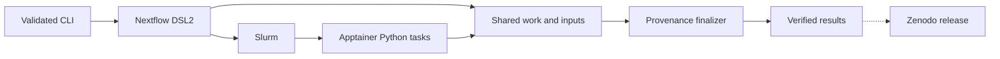
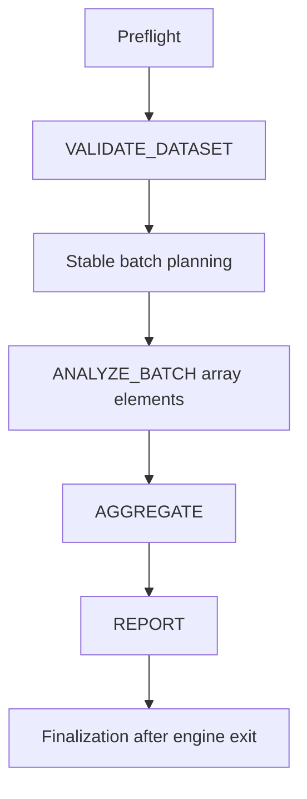

# Architecture

Decode, blur, segmentation, measurement, QC and output writing are fused per image inside ANALYZE_BATCH. One batch is the checkpoint unit. Nextflow owns caching and submission; the CLI does not run an alternative scheduler. Publishers copy declared files into a fresh result directory. Consumers use channels, never published paths.

The disposable lab runs a real Slurm controller, worker, accounting daemon and socket-local database within one Linux container. Four worker CPU slots share a physical host; this is not a physical multinode benchmark. No service ports are published. The lab requires privileges for nested namespaces and cgroups; the actual scientific Slurm jobs run as researcher (UID 1001). University deployments use existing Apptainer and Slurm services, not the lab container.
